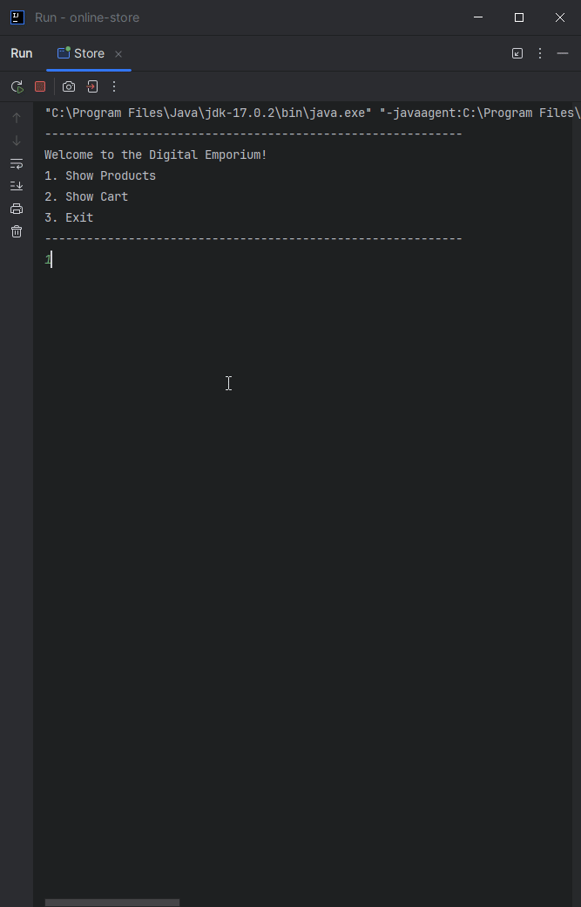

# Project Title

## Description of the Project

Welcome to the Digital Emporium! This program reads products from a CSV input file.
These products populate the store, where users can view available products, place them in a virtual cart,
and then check out with virtual money!

## Setup

### Prerequisites

- IntelliJ IDEA: Ensure you have IntelliJ IDEA installed, which you can download from [here](https://www.jetbrains.com/idea/download/).
- Java SDK: Make sure Java SDK is installed and configured in IntelliJ.

### Running the Application in IntelliJ

Follow these steps to get your application running within IntelliJ IDEA:

1. Open IntelliJ IDEA.
2. Select "Open" and navigate to the directory where you cloned or downloaded the project.
3. After the project opens, wait for IntelliJ to index the files and set up the project.
4. Find the main class with the `public static void main(String[] args)` method.
5. Right-click on the file and select 'Run 'YourMainClassName.main()'' to start the application.

## Technologies Used

- Java: Maven 17.
- Java I/O, scanners/file reading.

## Demo

## Future Work

Outline potential future enhancements or functionalities you might consider adding:

- Writing to CSV file, saving personal profiles.
- Improvement of error handling, improvement of performance.

## Resources

List resources such as tutorials, articles, or documentation that helped you during the project.

- [Raymond Maroun's GitHub](https://github.com/RayMaroun/yearup-spring-section-10-2025/tree/master/pluralsight) - Vital Information
- [Previous Java Project](https://github.com/AdampJessie/FinancialTracker) - Very Similar Project, recently completed
- [ChatGPT](https://chatgpt.com/) - Syntax/Formatting Assistance

## Team Members

- **Adam Jessie** - Logic/Formatting.
- **Raymond Maroun** - Foundational Skeleton Code.

## Thanks

Express gratitude towards those who provided help, guidance, or resources:

- Thank you to instructor Raymond Maroun for unending support and guidance.
- A special thanks to all individuals who view/use this project!
 